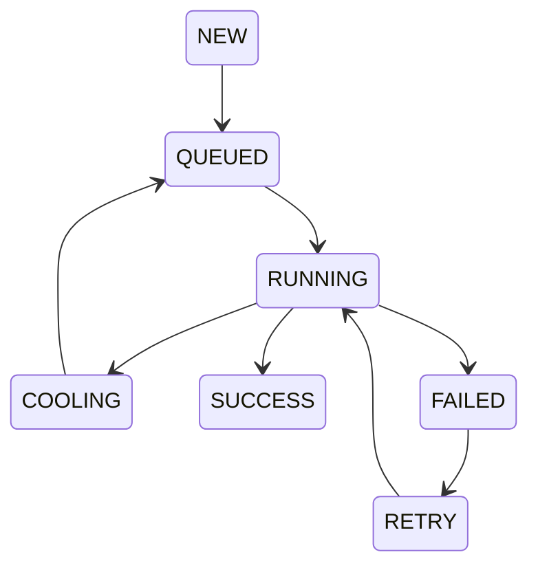
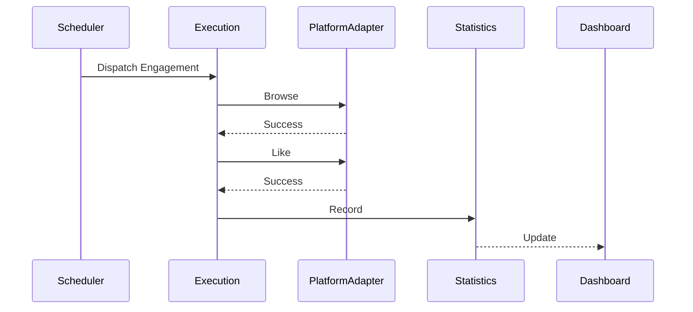
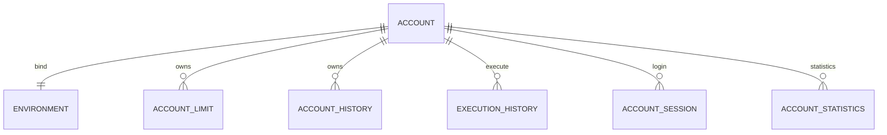

# ATOS Software Specification

**Project Name:** AI Traffic Operating System

**Short Name:** ATOS

**Version:** 0.9

**Status:** Draft

**Primary Language:** Chinese

**Source of Truth:** This document is the primary product and system specification for ATOS.

---

## 1. 项目定位

ATOS 是一套 AI Traffic Operating System，不是单一 Reddit 自动回复工具，也不是单一社媒机器人。

ATOS 的目标是统一管理：

- 多平台数据采集
- 多账号运营
- AI 内容分析
- AI 回复生成
- 策略调度
- 浏览器执行
- 账号养成
- 风控
- 统计分析
- 系统配置

回复只是 ATOS 的一个执行动作，不是系统本身。

ATOS 的核心是：

> 数据 → AI 分析 → Strategy → Scheduler → Execution → Statistics → Optimization

---

## 2. 设计原则

### 2.1 Strategy First

ATOS 不直接执行“回复”“点赞”“浏览”等动作。

系统必须先选择 Strategy，再由 Strategy 决定具体动作组合。

Strategy 可以包括：

- Warm-up
- Silent Browse
- Like Only
- Reply
- Brand Exposure
- Education
- Story
- Mixed Engagement

### 2.2 Scheduler First

任何任务进入执行前，必须经过 Scheduler。

禁止任何模块绕过 Scheduler 直接进入 Execution。

Scheduler 负责：

- 平台轮询
- 平台权重
- 账号权重
- 工作时间
- 随机延迟
- 冷却机制
- 风控检查
- 执行顺序
- 任务分发

### 2.3 Platform Agnostic

平台只是 Adapter。

业务代码不得写死 Reddit、Facebook、X、Instagram、TikTok 等平台逻辑。

所有平台差异必须通过 Platform Adapter 处理。

### 2.4 AI Replaceable

所有 AI 模型必须可替换。

系统不得绑定单一 AI Provider。

支持：

- OpenAI
- Anthropic
- Gemini
- Ollama
- Local Model
- Custom API

### 2.5 Configuration First

所有核心行为必须可配置。

包括：

- 平台权重
- 账号权重
- 工作时间
- 每日限额
- 随机延迟
- Prompt
- Model
- Strategy
- 风控规则
- TGE 环境
- Playwright 参数

禁止硬编码业务规则。

---

## 3. 系统一级模块

ATOS 包含以下一级模块：

1. Dashboard
2. Data Center
3. AI Workspace
4. Scheduler
5. Execution
6. Engagement
7. Account Center
8. Statistics
9. System Settings
10. System Architecture
11. Platform Adapters
12. Shared Components

---

## 4. Dashboard

Dashboard 是 ATOS Console 的首页。

Dashboard 的目标是让运营人员在进入系统后，立即看到：

- 今日任务情况
- 今日采集数量
- AI 生成状态
- 待审核数量
- 待执行数量
- 执行成功率
- 账号健康状态
- Scheduler 状态
- TGE 状态
- Playwright 状态
- Apify 状态
- 系统异常
- 转化漏斗

Dashboard 不允许直接访问业务数据库。

Dashboard 必须通过 Statistics Service 和 Health Service 获取数据。

---

## 5. Data Center

Data Center 是所有外部数据进入 ATOS 的统一入口。

第一阶段正式支持 Apify。

Data Center 必须支持：

- 多个 Apify API Token
- 多个 Actor ID
- Actor 备注
- 平台映射
- Input JSON 配置
- 手动采集
- 定时采集
- 采集日志
- 失败重试
- 数据去重
- Parser
- Normalizer
- Post Pool 入库

所有采集内容必须先进入 Post Pool。

禁止 Data Center 直接把内容发送到 AI Workspace 或 Scheduler。

---

## 6. Post Pool

Post Pool 是帖子进入系统后的统一池子。

Post Pool 必须支持：

- 全部平台查看
- 单平台筛选
- 多平台筛选
- 平台轮询排序
- 权重轮询排序
- 按 AI 状态筛选
- 按商业价值筛选
- 按风险等级筛选
- 按是否历史回复筛选
- 按是否重复筛选
- 按是否进入 Scheduler 筛选

当多个平台被选中时，队列排序必须支持平台轮询。

示例：

Reddit、Facebook、X 被同时选中时，排序不应是：

Reddit, Reddit, Reddit, Facebook, Facebook, X

而应支持：

Reddit, Facebook, X, Reddit, Facebook, X

如果某个平台任务耗尽，则跳过该平台继续轮询。

---

## 7. AI Workspace

AI Workspace 负责：

- 帖子内容分析
- 商业价值评分
- 风险评分
- Strategy 推荐
- Prompt 组装
- 回复生成
- 变量注入
- 重复检测
- Fallback
- 人工审核
- 批量审批

AI Workspace 必须标记每条回复的生成来源：

- LLM Generated
- Fallback Model
- Template Generated
- Manual Edited

AI Workspace 必须支持重新生成回复。

---

## 8. Scheduler

Scheduler 是 ATOS 的调度核心。

Scheduler 必须支持：

- FIFO
- Platform Round Robin
- Weighted Round Robin
- Random
- Priority First
- Hybrid Strategy

Scheduler 必须支持随机延迟开关。

随机延迟必须可配置：

- enable_random_delay
- min_delay_seconds
- max_delay_seconds

每个账号必须支持工作时间配置。

工作时间可按星期、时间段、平台设置。

---

## 9. Execution

Execution 负责通过 TGE + Playwright 执行任务。

Execution 必须支持：

- Attach 已开启的 TGE 环境
- 如果环境未开启，则启动环境
- 环境保持常驻
- 当前任务完成后关闭当前 Tab
- 不关闭整个 TGE 环境
- 执行前检查登录状态
- 检查帖子是否存在
- 检查评论框是否可用
- 检查是否出现验证码或限制
- 保存截图
- 保存 Replay 日志

半自动模式：

- 自动打开页面
- 自动定位评论框
- 自动粘贴内容
- 等待人工点击提交
- 提交后关闭当前 Tab
- 打开下一任务

全自动模式：

- 自动完成全部动作
- 仅在配置开启时使用

---

## 10. Engagement

Engagement 是独立互动中心。

Engagement 支持：

- 浏览帖子
- 点赞
- 收藏
- 浏览主页
- 展开评论
- 随机滚动
- 随机停留
- 关键词浏览
- 指定板块浏览
- 回复前预热

半自动模式下，Engagement 应作为独立任务运行。

全自动模式下，Engagement 可以作为 Reply 前置流程。

---

## 11. Account Center

Account Center 管理所有平台账号。

每个账号必须支持：

- 平台
- 用户名
- Profile URL
- TGE Environment ID
- Proxy
- Karma / Followers
- Account Age
- Health Score
- Daily Browse Limit
- Daily Like Limit
- Daily Reply Limit
- Daily DM Limit
- Work Time
- Risk Status
- Cooling Down
- Auto Downgrade

账号异常时，系统必须自动降级，而不是仅依赖人工处理。

---

## 12. Statistics

Statistics 负责全系统统计。

必须支持：

- 平台统计
- 账号统计
- Strategy 统计
- AI 模型统计
- Prompt 统计
- Token 成本统计
- Execution 成功率
- Engagement 成功率
- CTR
- CVR
- 转化漏斗

---

## 13. System Settings

System Settings 是全局配置中心。

必须支持：

- LLM Provider
- Prompt Template
- Platform Config
- TGE Config
- Playwright Config
- Scheduler Defaults
- Engagement Defaults
- API Key
- RBAC
- Audit Log
- Backup / Restore

所有敏感配置必须加密保存。

---

## 14. Developer Rules

开发必须遵守：

- 禁止硬编码平台
- 禁止硬编码模型
- 禁止硬编码 Prompt
- 禁止 Worker 直接调用其他 Worker
- 禁止绕过 Scheduler 执行任务
- 禁止页面直接访问数据库
- 所有操作必须记录 Audit Log
- 所有任务必须有状态机
- 所有外部调用必须有超时和重试
- 所有模块必须支持配置化

---

## 15. 当前文档版本范围

Version 0.1 定义 ATOS 的产品与系统主干。

后续版本将继续补充：

- UI 详细规范
- 数据库字段
- API DTO
- 状态机图
- 事件定义
- Redis Key
- Queue
- 错误码
- 测试规范

---

# PART II Dashboard

---

# Chapter 1 Dashboard

## 1.1 模块定位

Dashboard 是整个 ATOS Console 的默认首页。

Dashboard 不负责业务处理。

Dashboard 负责：

- 展示
- 聚合
- 导航
- 告警

Dashboard 是整个系统的运行驾驶舱（Operation Cockpit）。

所有业务数据均来自其它 Service。

Dashboard 自身禁止直接访问业务数据库。

---

## 1.2 页面目标

运营人员进入系统后的 3 秒内，应能够知道：

- 今天有没有新帖子
- AI 有没有异常
- Scheduler 是否正常
- Execution 是否正常
- 哪些账号异常
- 哪些平台异常
- 哪些任务等待处理
- 今天的数据是否达到目标

Dashboard 的目标：

让运营人员无需进入任何模块即可了解整个系统状态。

---

## 1.3 页面布局

Dashboard 分为九个区域：

- Header
- Sidebar
- Overview Cards
- Pending Queue
- Platform Health
- System Health
- Statistics
- Quick Actions
- Recent Activity

布局如下：

Header

↓

Sidebar + Main

↓

Overview Cards

↓

Statistics

↓

Recent Activity

---

## 1.4 Header

Header 固定高度：

64px

Header 包含：

- Logo
- Global Search
- Notification
- Current Workspace
- Current User
- Theme Switch
- Language
- System Status

所有页面共享 Header。

---

## 1.5 Sidebar

Sidebar 为整个 Console 的一级导航。

包含：

- Dashboard
- Data Center
- Post Pool
- AI Workspace
- Scheduler
- Execution
- Engagement
- Account Center
- Statistics
- Settings

Sidebar 支持：

- 折叠
- 收藏
- 最近访问
- 快捷键

---

## 1.6 Overview Cards

默认显示：

- Today's Posts
- AI Pending
- Pending Review
- Execution Queue
- Today's Reply
- Success Rate
- CTR
- CVR
- Running Accounts
- Online TGE
- Running Workers
- System Health

所有 Card：

支持点击。

点击后进入对应模块。

Card 不允许编辑业务数据。

---

## 1.7 Pending Queue

显示：

- AI Pending
- Review Pending
- Scheduler Pending
- Execution Pending
- Error Queue

每一项：

点击：

进入对应模块。

---

## 1.8 Platform Health

每个平台：

显示：

- Platform
- Status
- Account Count
- Running
- Cooldown
- Error
- Today's Tasks
- Today's Success

默认：

- Reddit
- Facebook
- X
- Instagram
- TikTok
- YouTube
- Quora

后续新增平台无需修改 Dashboard。

---

## 1.9 System Health

展示：

- AI
- Scheduler
- Execution
- Apify
- Redis
- Database
- Worker
- TGE
- Playwright
- Health Service

全部：

绿色：

Healthy

黄色：

Warning

红色：

Error

支持：

点击：

查看详情。

---

## 1.10 Statistics

Dashboard 默认展示：

- Posts
- Replies
- CTR
- CVR
- Conversions
- AI Cost
- Prompt Usage
- Model Usage
- Execution Time
- Reply Success
- Platform Distribution
- Account Distribution

支持：

- Today
- Yesterday
- 7 Days
- 30 Days
- Custom Range

---

## 1.11 Quick Actions

Dashboard 支持：

- Run Crawler
- Generate AI
- Run Scheduler
- Open Execution
- Open Engagement
- Refresh Statistics
- Restart Worker
- Reload Config

Quick Actions：

必须支持权限控制。

---

## 1.12 Recent Activity

显示：

最近100条：

- AI
- Scheduler
- Execution
- System
- Platform
- Account
- Config

所有日志：

支持：

点击：

查看详情。

---

## 1.13 Dashboard 数据来源

Dashboard 禁止直接查询：

- posts
- accounts
- scheduler
- execution
- 等业务表

Dashboard 仅允许调用：

- Statistics Service
- Health Service
- Configuration Service
- Audit Service

Dashboard API：

负责：

聚合。

---

## 1.14 Dashboard API

Dashboard：

需要：

GET

/dashboard/summary

GET

/dashboard/statistics

GET

/dashboard/health

GET

/dashboard/activity

Dashboard：

不允许：

POST。

---

## 1.15 Dashboard Cache

Dashboard：

默认：

Redis：

30 秒。

Statistics：

60 秒。

Health：

10 秒。

Notification：

实时。

---

## 1.16 Dashboard 权限

Administrator

全部

Operator

全部运营数据

Reviewer

审核相关

Viewer

只读

Dashboard：

所有按钮：

必须：

RBAC。

---

## 1.17 Dashboard 日志

所有：

- 点击
- 刷新
- 搜索
- 筛选
- 跳转

全部：

Audit Log。

---

## 1.18 Dashboard 性能要求

首次打开：

<2 秒

刷新：

<500ms

所有：

统计：

异步。

禁止：

Dashboard：

等待：

AI。

---

## 1.19 Dashboard 开发原则

Dashboard：

禁止：

业务逻辑。

Dashboard：

禁止：

数据库。

Dashboard：

禁止：

平台判断。

Dashboard：

只负责：

展示。

所有：

计算：

必须：

Service。

==============================================================

# PART III Data Center

---

# Chapter 2 Data Center

## 2.1 模块定位

Data Center 是整个 ATOS 唯一的数据入口（Single Entry）。

所有外部数据：

必须先进入 Data Center。

任何模块：

不得直接采集。

例如：

- AI Workspace
- Scheduler
- Execution

均禁止直接调用：

- Apify
- RSS
- API
- Crawler

Data Center 是整个系统唯一的数据接入层。

---

## 2.2 系统职责

Data Center 负责：

- 数据采集
- 数据标准化
- 数据清洗
- 去重
- 标签
- 统一编号
- 平台识别
- 帖子池入库
- 事件通知

Data Center：

绝不负责：

- AI
- Scheduler
- Execution

---

## 2.3 数据来源

V1：

支持：

- Apify

V2：

增加：

- RSS
- JSON
- Webhook
- CSV
- Manual Import
- Official API

所有来源：

统一：

Source Adapter。

---

## 2.4 Source Adapter

所有采集器：

必须实现：

SourceAdapter Interface

统一接口：

- connect()
- test()
- crawl()
- parse()
- normalize()
- validate()
- close()

新增平台：

不得修改：

Data Center。

仅新增：

Adapter。

---

## 2.5 Apify

支持：

- 多个 Token
- 多个 Workspace
- 多个 Actor
- 多个 Input
- 多个 Dataset
- 多个 Schedule

支持：

- 备注
- 状态
- Owner
- 更新时间
- 失败次数
- 成功率
- 平均耗时

---

## 2.6 Actor 管理

Actor：

必须支持：

- 启用
- 停用
- 测试
- 复制
- 版本
- 备注
- 默认 Input
- 最近运行
- 最近错误

每个 Actor：

绑定：

平台。

例如：

- Reddit
- Facebook
- X
- Instagram
- TikTok

---

## 2.7 Platform Mapping

平台：

不是：

Actor。

Actor：

属于：

平台。

例如：

Platform：

Reddit

↓

Actor：

Search ADHD

Actor：

Search Adderall

Actor：

Search Vyvanse

Actor：

Search Concerta

多个：

Actor。

统一：

进入：

Reddit。

---

## 2.8 Crawl Job

每一次采集：

都是：

Job。

Job：

包含：

- Job ID
- Source
- Platform
- Actor
- Status
- Created Time
- Start Time
- End Time
- Duration
- Result Count
- Duplicate Count
- Error Count

---

## 2.9 数据标准化

所有帖子：

统一：

Post Object。

统一字段：

- Platform
- Community
- Author
- Author ID
- Title
- Content
- URL
- Media
- Published Time
- Language
- Source
- Source Post ID
- Hash
- Tags
- Metadata

禁止：

平台：

自定义字段：

直接进入：

Post Pool。

---

## 2.10 Parser

Parser：

负责：

解析：

原始 JSON。

Parser：

不得：

写数据库。

Parser：

只返回：

Post Object。

---

## 2.11 Normalizer

Normalizer：

负责：

统一：

- 时间
- URL
- 媒体
- 编码
- Emoji
- Markdown
- HTML
- Mention
- Link

所有帖子：

统一格式。

---

## 2.12 Validator

Validator：

负责：

检查：

是否：

合法。

例如：

URL

为空。

标题：

为空。

作者：

为空。

时间：

非法。

全部：

Reject。

---

## 2.13 Deduplicator

重复检测：

第一层：

Platform

+

Source Post ID

第二层：

Hash

第三层：

Embedding

第四层：

Semantic

如果：

重复。

写入：

Duplicate Log。

不进入：

Post Pool。

---

## 2.14 Post UUID

进入：

ATOS：

以后。

统一：

生成：

UUID。

之后：

整个系统：

只使用：

UUID。

禁止：

直接使用：

Platform ID。

---

## 2.15 Tag Engine

Data Center：

负责：

基础标签。

例如：

- Platform
- Community
- Language
- Medication
- Intent
- Question
- Experience
- Review
- Emergency

这些标签：

AI：

继续扩展。

---

## 2.16 Event

成功：

POST_IMPORTED

失败：

POST_IMPORT_FAILED

重复：

POST_DUPLICATED

Parser：

POST_PARSED

Normalizer：

POST_NORMALIZED

Validator：

POST_VALIDATED

事件：

统一：

Event Bus。

---

## 2.17 Retry

采集失败：

支持：

Retry。

默认：

3次。

指数退避。

Retry：

记录：

日志。

---

## 2.18 Dashboard

Dashboard：

显示：

- Today's Import
- Today's Duplicate
- Today's Error
- Today's Job
- Average Duration
- Success Rate

---

## 2.19 Data Center API

GET

/data-center/source

GET

/data-center/job

GET

/data-center/platform

POST

/data-center/run

POST

/data-center/retry

POST

/data-center/test

POST

/data-center/import

---

## 2.20 开发原则

Data Center：

禁止：

AI。

禁止：

Execution。

禁止：

Scheduler。

禁止：

Platform Logic。

禁止：

业务判断。

Data Center：

只负责：

Data。

==============================================================

# PART IV AI Workspace

---

# Chapter 3 AI Workspace

## 3.1 模块定位

AI Workspace 是整个 ATOS 的智能决策中心。

AI Workspace 不是一个 ChatGPT 页面。

AI Workspace 的职责包括：

- 内容分析
- 商业价值评估
- 风险评估
- Strategy 推荐
- Prompt 构建
- 回复生成
- 重复检测
- Fallback
- 人工审核
- 批量审批
- AI 数据统计

AI Workspace 是 Scheduler 的唯一上游。

未经 AI Workspace 审核通过的数据，不允许进入 Scheduler。

---

# 3.2 Processing Pipeline

AI Pipeline：

Post Pool

↓

Content Analysis

↓

Commercial Analysis

↓

Risk Analysis

↓

Intent Classification

↓

Strategy Selection

↓

Prompt Builder

↓

LLM Generation

↓

Embedding Compare

↓

Fallback

↓

Human Review

↓

Approved

↓

Scheduler

任何步骤失败：

进入：

Retry Queue。

---

# 3.3 Content Analysis

AI 第一阶段：

分析帖子。

输出：

- Language
- Emotion
- Topic
- Medication
- Community
- Intent
- Urgency
- Experience
- Question
- Commercial Score
- Risk Score
- Confidence

所有分析：

保存：

Analysis Result。

禁止覆盖。

---

# 3.4 Intent Classification

Intent：

支持：

- Question
- Purchase
- Information
- Complaint
- Experience
- Review
- Recommendation
- Comparison
- Story
- Emergency
- Support

Intent：

允许多个。

例如：

Question

+

Purchase

---

# 3.5 Commercial Score

商业价值：

0~100。

评分：

由：

AI。

考虑：

- Medication
- Buying Intent
- Urgency
- Emotion
- History
- Community

评分：

保存。

后续：

Statistics。

---

# 3.6 Risk Score

风险：

0~100。

例如：

- Spam
- Medical Risk
- Platform Risk
- Sensitive
- Illegal
- Emergency

Risk：

高于：

Threshold。

进入：

Manual Review。

---

# 3.7 Strategy Recommendation

AI：

自动推荐：

Strategy。

例如：

- Warm-up
- Education
- Story
- Direct Reply
- Brand Exposure
- Silent Browse
- Mixed Engagement

允许：

人工修改。

---

# 3.8 Prompt Builder

Prompt：

由：

多个部分：

组合。

包括：

- System Prompt
- Platform Prompt
- Role Prompt
- Strategy Prompt
- Variables
- User Prompt
- Context
- History

所有 Prompt：

记录：

Version。

---

# 3.9 Variables

支持：

- {{landing_link}}
- {{mention}}
- {{profile}}
- {{cta}}
- {{username}}
- {{community}}
- {{tone}}
- {{emoji}}
- {{platform}}

变量：

支持：

平台过滤。

例如：

Reddit：

不允许：

Short Link。

Facebook：

允许。

---

# 3.10 LLM Provider

Provider：

统一：

Provider Adapter。

支持：

- OpenAI
- Anthropic
- Gemini
- Ollama
- Local
- Custom API

业务：

不得：

直接：

调用：

OpenAI SDK。

---

# 3.11 Model Routing

支持：

按：

- Platform
- Community
- Language
- Commercial Score
- Risk

自动：

选择：

Model。

例如：

Reddit：

GPT

TikTok：

Gemini

Medical：

Claude

---

# 3.12 Fallback

失败：

自动：

Fallback。

优先级：

Primary

↓

Backup

↓

Template

↓

Manual

全部：

记录：

原因。

---

# 3.13 Embedding

所有：

回复。

生成：

Embedding。

支持：

Cosine Similarity。

默认：

Threshold：

0.85。

超过：

自动：

Rewrite。

---

# 3.14 Human Review

支持：

- Approve
- Reject
- Edit
- Regenerate
- Switch Model
- Switch Strategy
- Edit Variables
- History
- Diff

所有：

操作：

Audit。

---

# 3.15 Batch Review

支持：

批量：

- Approve
- Reject
- Assign
- Regenerate
- Change Strategy
- Change Prompt

---

# 3.16 Reply Status

Reply：

状态：

GENERATING

↓

GENERATED

↓

REVIEWING

↓

APPROVED

↓

QUEUED

↓

EXECUTED

↓

ARCHIVED

失败：

ERROR

↓

RETRY

---

# 3.17 Dashboard

Dashboard：

新增：

AI：

统计。

包括：

- Today's Generation
- Today's Review
- Approval Rate
- Fallback Rate
- Average Token
- Average Cost
- Average Time
- Top Prompt
- Top Model

---

# 3.18 API

GET

/ai/tasks

GET

/ai/result

POST

/ai/generate

POST

/ai/retry

POST

/ai/review

POST

/ai/approve

POST

/ai/reject

POST

/ai/regenerate

POST

/ai/switch-model

---

# 3.19 Developer Rules

AI Workspace：

不得：

直接：

Scheduler。

必须：

Approved。

AI：

不得：

直接：

Execution。

所有：

Provider：

必须：

Adapter。

所有：

Prompt：

必须：

Version。

所有：

Variables：

必须：

Config。

==============================================================

# PART V Scheduler

---

# Chapter 4 Scheduler

## 4.1 模块定位

Scheduler 是整个 ATOS 的中央调度引擎（Central Scheduling Engine）。

整个系统只有一个 Scheduler。

任何任务：

包括：

- Browse
- Like
- Bookmark
- Visit Profile
- Follow
- Reply
- Future DM
- Future Posting

全部必须进入 Scheduler。

任何模块：

禁止：

直接调用：

Execution。

---

# 4.2 Scheduler Philosophy

Scheduler 的职责：

不是：

决定：

回复。

Scheduler：

决定：

- 什么时候
- 哪个账号
- 哪个平台
- 执行什么行为。

一句话：

Scheduler：

负责：

时间。

Execution：

负责：

动作。

---

# 4.3 Scheduler Pipeline

Approved Task

↓

Risk Check

↓

Platform Selection

↓

Account Selection

↓

Working Time Check

↓

Cooling Check

↓

Random Delay

↓

Behavior Mix

↓

Execution Queue

↓

Execution

↓

Feedback

↓

Statistics

---

# 4.4 Scheduler Queue

系统存在多个 Queue。

- AI Queue
- Review Queue
- Scheduler Queue
- Execution Queue
- Statistics Queue

Scheduler：

仅负责：

Scheduler Queue。

---

# 4.5 Platform Weight

平台：

支持：

权重。

例如：

Reddit

50

Facebook

30

X

20

Instagram

15

TikTok

10

YouTube

5

Quora

5

权重：

支持：

后台修改。

实时生效。

---

# 4.6 Platform Round Robin

如果：

多个平台：

开启。

Scheduler：

默认：

轮询。

例如：

Reddit

↓

Facebook

↓

X

↓

Reddit

↓

Facebook

↓

X

同一个平台：

连续出现：

必须：

满足：

冷却。

---

# 4.7 Weighted Round Robin

平台：

允许：

权重。

例如：

50

30

20

Scheduler：

自动：

计算：

比例。

例如：

100任务。

Reddit：

50

Facebook：

30

X：

20

---

# 4.8 Account Selection

账号：

选择：

不是：

随机。

评分：

包括：

- Health Score
- Karma
- Followers
- Cooling
- Daily Limit
- Working Time
- Success Rate
- Risk Level
- Recent Activity

最终：

Score。

最高：

优先。

---

# 4.9 Health Score

账号：

Health：

默认：

100。

成功：

+

失败：

-

限制：

-

封号：

-

长期：

稳定：

+

Scheduler：

优先：

高分账号。

---

# 4.10 Working Time

每个账号：

支持：

多个：

时间段。

例如：

09:00

12:00

14:00

18:00

20:00

23:00

Scheduler：

禁止：

工作时间外：

派发。

---

# 4.11 Random Delay

支持：

- Enable
- Min Delay
- Max Delay

例如：

120

~

480

Scheduler：

随机。

每个平台：

可配置。

每账号：

可配置。

---

# 4.12 Cooling

账号：

Reply：

完成。

Cooling：

例如：

35分钟。

Browse：

完成。

Cooling：

8分钟。

Like：

完成。

Cooling：

5分钟。

平台：

分别：

配置。

---

# 4.13 Daily Limit

- Browse
- Like
- Bookmark
- Visit
- Reply
- DM
- Follow

全部：

每日：

独立：

限制。

支持：

平台：

覆盖。

---

# 4.14 Behavior Mix

Scheduler：

不是：

一直：

Reply。

Scheduler：

允许：

插入：

- Browse
- Like
- Bookmark
- Visit Profile

随机：

混合。

例如：

Browse

Browse

Like

Reply

Browse

Bookmark

Reply

这样：

行为：

更加：

真人。

---

# 4.15 Engagement Injection

如果：

开启：

Reply Warm-up。

Scheduler：

自动：

插入：

Engagement。

例如：

Reply：

之前。

Browse：

3

Like：

2

Visit：

1

然后：

Reply。

---

# 4.16 Risk Check

派发：

之前。

检查：

- Platform
- Account
- Cookie
- Login
- Health
- Risk
- Proxy
- Working Time
- Daily Limit
- Cooldown

任何：

失败。

Reject。

---

# 4.17 Retry

Execution：

失败。

支持：

Retry。

默认：

3次。

Retry：

指数退避。

记录：

日志。

---

# 4.18 Queue Priority

支持：

Priority。

例如：

- VIP
- High
- Medium
- Low
- Emergency

Scheduler：

优先：

高等级。

---

# 4.19 Manual Override

Operator：

允许：

暂停：

Scheduler。

允许：

手动：

派发。

允许：

指定：

账号。

允许：

指定：

平台。

全部：

Audit。

---

# 4.20 Scheduler Event

- TASK_CREATED
- TASK_APPROVED
- TASK_QUEUED
- TASK_DELAYED
- TASK_DISPATCHED
- TASK_EXECUTED
- TASK_FAILED
- ACCOUNT_COOLING
- ACCOUNT_RECOVERED

全部：

Event Bus。

---

# 4.21 Scheduler Dashboard

Dashboard：

增加：

- Today's Queue
- Today's Dispatch
- Today's Delay
- Today's Retry
- Today's Cooldown
- Today's Success
- Today's Failure

---

# 4.22 Scheduler API

GET

/scheduler/task

GET

/scheduler/account

GET

/scheduler/platform

POST

/scheduler/run

POST

/scheduler/pause

POST

/scheduler/resume

POST

/scheduler/retry

POST

/scheduler/rebuild

---

# 4.23 Scheduler Rules

Scheduler：

禁止：

业务判断。

Scheduler：

禁止：

AI。

Scheduler：

禁止：

平台DOM。

Scheduler：

只负责：

调度。

Execution：

负责：

执行。

==============================================================

# PART VI Execution

---

# Chapter 5 Execution

## 5.1 模块定位

Execution 是整个 ATOS 唯一执行层。

Execution 不负责：

- AI
- Strategy
- Scheduler
- Business Logic

Execution 只负责：

把 Scheduler 分发下来的任务，准确、安全、可追踪地执行。

Execution 的输入：

Task。

Execution 的输出：

Execution Result。

---

# 5.2 Execution Kernel

Execution Kernel 由：

Environment Manager

↓

Browser Manager

↓

Tab Manager

↓

Platform Adapter

↓

Playwright Driver

↓

Execution Result

组成。

Execution Kernel：

不得：

包含：

业务逻辑。

---

# 5.3 Environment Manager

每一个账号：

绑定：

唯一：

TGE Environment。

Scheduler：

派发：

任务。

Execution：

首先：

检查：

Environment。

如果：

已经运行：

Attach。

如果：

未运行：

Start。

Environment：

保持：

长期在线。

禁止：

每次：

启动。

---

# 5.4 Environment Health

Environment：

实时：

Health。

包括：

- Running
- Disconnected
- Busy
- Error
- Recovering
- Offline

Dashboard：

实时：

显示。

---

# 5.5 Browser Manager

Browser：

管理：

整个：

Browser。

包括：

- Window
- Profile
- Context
- Memory
- CPU
- Proxy
- Heartbeat

Execution：

不得：

重复：

创建：

Browser。

---

# 5.6 Tab Manager

真正：

工作的：

不是：

Browser。

而是：

Tab。

生命周期：

Create

↓

Load

↓

Execute

↓

Save

↓

Close

Browser：

继续：

保留。

---

# 5.7 Tab Pool

Execution：

维护：

Tab Pool。

避免：

频繁：

创建：

Tab。

支持：

Reuse。

支持：

Auto Close。

支持：

Health Check。

---

# 5.8 Platform Adapter

Execution：

绝不：

知道：

Reddit。

Execution：

只知道：

Platform Adapter。

例如：

- adapter.open()
- adapter.reply()
- adapter.like()
- adapter.visit()
- adapter.bookmark()
- adapter.follow()

以后：

增加：

Threads。

无需：

修改：

Execution。

---

# 5.9 Playwright Driver

Execution：

统一：

调用：

Playwright Driver。

Driver：

负责：

- Locator
- Click
- Input
- Scroll
- Wait
- Hover
- Screenshot
- Replay

Execution：

禁止：

直接：

Selector。

---

# 5.10 Execution Strategy

Execution：

支持：

- Browse
- Like
- Bookmark
- Visit Profile
- Reply
- Reply + Browse
- Reply + Like
- Mixed

全部：

来自：

Strategy。

Execution：

不决定：

行为。

---

# 5.11 Semi Auto

半自动：

Execution：

负责：

打开：

页面。

↓

定位：

输入框。

↓

填写：

回复。

↓

定位：

Submit。

↓

等待：

人工。

↓

检测：

页面变化。

↓

Close Tab。

↓

Next Task。

人工：

只点击：

一次。

---

# 5.12 Full Auto

全自动：

Execution：

完成：

全部。

提交：

之前：

再次：

Risk Check。

成功：

Close Tab。

失败：

Retry。

---

# 5.13 Auto Close

任务：

完成。

立即：

Close Current Tab。

禁止：

浏览器：

越来越多：

Tab。

Environment：

保持。

Tab：

关闭。

---

# 5.14 Auto Attach

Execution：

默认：

Attach。

已经：

打开：

Environment。

只有：

不存在：

Environment。

才：

Start。

减少：

启动：

次数。

---

# 5.15 Pre Check

执行：

之前：

检查：

- Cookie
- Login
- Proxy
- Page
- Comment Box
- Rate Limit
- Network
- Platform Status

任何：

失败。

Reject。

---

# 5.16 Runtime Check

执行：

过程中：

持续：

检查：

- Captcha
- 429
- 403
- Login Lost
- Popup
- Dialog

任何：

异常。

暂停：

Execution。

---

# 5.17 Replay

Execution：

自动：

保存：

- Screenshot
- HTML
- Console
- Network
- Timeline
- Replay JSON

方便：

Debug。

---

# 5.18 Execution Result

统一：

Result。

- SUCCESS
- FAILED
- RETRY
- BLOCKED
- COOLDOWN
- SKIPPED

全部：

保存。

---

# 5.19 Retry Strategy

Retry：

默认：

3次。

支持：

Exponential Backoff。

支持：

Manual Retry。

支持：

Scheduler Retry。

---

# 5.20 Execution Event

EXECUTION_STARTED

↓

PAGE_OPENED

↓

ACTION_STARTED

↓

ACTION_FINISHED

↓

EXECUTION_SUCCESS

↓

EXECUTION_FAILED

↓

REPLAY_SAVED

↓

TAB_CLOSED

全部：

Event Bus。

---

# 5.21 Dashboard

Execution：

新增：

- Today's Execution
- Execution Time
- Average Duration
- Retry Count
- Replay Count
- Current Running
- Current Waiting
- Current Error

---

# 5.22 API

GET

/execution/task

GET

/execution/replay

POST

/execution/start

POST

/execution/retry

POST

/execution/attach

POST

/execution/close-tab

POST

/execution/recover

---

# 5.23 Developer Rules

Execution：

不得：

Scheduler。

不得：

AI。

不得：

Business。

Execution：

唯一：

目标：

Execute。

==============================================================

# PART VII Engagement

---

# Chapter 6 Engagement

## 6.1 模块定位

Engagement（互动中心）负责模拟真实用户行为。

目标不是增加互动数量。

目标是建立：

Natural Behavior Pattern（自然行为轨迹）。

Engagement 可以：

独立运行。

也可以：

作为 Reply 前置流程。

---

# 6.2 设计原则

Engagement 永远不是：

点赞机器人。

也不是：

浏览机器人。

Engagement 是：

Behavior Engine。

所有行为：

都由：

Strategy 决定。

Scheduler：

负责：

时间。

Execution：

负责：

执行。

Engagement：

负责：

行为组合。

---

# 6.3 Supported Behavior

支持：

- Browse
- Like
- Bookmark
- Visit Profile
- Expand Comment
- Scroll
- Pause
- Read
- Media View
- Follow（预留）
- DM（预留）
- Share（预留）

---

# 6.4 Behavior Strategy

系统内置：

- Warm-up
- Silent Browse
- Like Only
- Community Reading
- Profile Visit
- Mixed Engagement
- Reply Warm-up
- Custom Strategy

支持：

自定义。

支持：

导入。

支持：

版本。

---

# 6.5 Warm-up Strategy

Warm-up：

例如：

Browse：

3

↓

Pause：

20~60 秒

↓

Like：

1

↓

Browse：

2

↓

Visit Profile：

1

↓

Reply

Warm-up：

参数：

可配置。

---

# 6.6 Browse Strategy

支持：

- Keyword
- Community
- Trending
- Random
- Recent
- Bookmark History

Browse：

支持：

随机：

阅读深度。

随机：

滚动。

随机：

停留。

---

# 6.7 Like Strategy

支持：

Like Rate。

例如：

- 30%
- 50%
- 70%

支持：

每日：

Like Limit。

支持：

平台：

覆盖。

---

# 6.8 Visit Profile

支持：

随机：

进入：

主页。

浏览：

多个：

帖子。

随机：

停留。

然后：

退出。

避免：

固定行为。

---

# 6.9 Mixed Engagement

允许：

组合：

Browse

↓

Like

↓

Browse

↓

Profile

↓

Browse

↓

Reply

Scheduler：

随机：

插入。

---

# 6.10 Behavior Randomization

支持：

随机：

- Scroll
- Pause
- Mouse Move
- Hover
- Read Time
- Open Media
- 返回
- 继续阅读

所有：

行为：

随机。

禁止：

固定。

---

# 6.11 Risk Protection

每个平台：

独立：

限制：

- Browse
- Like
- Bookmark
- Visit
- Reply

达到：

Threshold。

自动：

Cooling。

---

# 6.12 Cooling

Cooling：

期间。

禁止：

Reply。

允许：

Browse。

允许：

Read。

允许：

Media。

支持：

后台：

配置。

---

# 6.13 Engagement Task

任务：

类型：

- Independent
- Before Reply
- Scheduled
- Daily
- Campaign
- Manual

---

# 6.14 Dashboard

新增：

- Today's Browse
- Today's Like
- Today's Bookmark
- Today's Reading Time
- Today's Profile Visit
- Today's Warm-up
- Today's Mixed

---

# 6.15 Entity

Entity：

EngagementTask

字段：

- task_id
- strategy_id
- account_id
- platform
- behavior_type
- priority
- status
- created_at
- started_at
- finished_at
- duration
- result
- risk_level

---

# 6.16 DTO

CreateEngagementTaskRequest

- strategy_id
- account_id
- platform
- behavior_count
- priority
- schedule_time

CreateEngagementTaskResponse

- task_id
- status
- estimated_start

---

# 6.17 State Machine



---

# 6.18 Sequence Diagram



---

# 6.19 API

GET

/engagement/tasks

GET

/engagement/statistics

POST

/engagement/create

POST

/engagement/run

POST

/engagement/pause

POST

/engagement/resume

POST

/engagement/cancel

---

# 6.20 Configuration

- enable_engagement
- enable_random_pause
- enable_random_scroll
- enable_profile_visit
- enable_media_view
- max_daily_browse
- max_daily_like
- max_daily_bookmark
- warmup_before_reply

---

# 6.21 Performance

任务创建：

<200ms

执行开始：

<1s

Dashboard：

刷新：

<500ms

---

# 6.22 Developer Rules

Engagement：

不得：

直接：

Scheduler。

不得：

直接：

AI。

所有：

行为：

Strategy。

所有：

时间：

Scheduler。

所有：

执行：

Execution。

==============================================================

# PART VIII Account Center

---

# Chapter 7 Account Center

## 7.1 模块定位

Account Center 是整个 ATOS 的账号资产管理中心（Account Asset Management）。

所有平台账号必须统一纳入 Account Center。

禁止任何模块直接维护账号。

Scheduler、Execution、Statistics、Engagement 只能读取 Account Service。

---

## 7.2 设计目标

Account Center 负责：

- 平台账号管理
- TGE Environment 绑定
- Proxy 管理
- Health Score
- Daily Limit
- Working Time
- Risk Control
- Platform Identity
- Session 生命周期
- 自动降级
- 自动恢复

Account 是整个系统最重要的资产。

任何行为最终都归属于某个 Account。

---

# 7.3 UI Layout

页面分为：

Account List

↓

Account Detail

↓

Health Panel

↓

Environment Panel

↓

Daily Limit

↓

Working Time

↓

History

↓

Statistics

---

# 7.4 Account List

显示：

- Platform
- Avatar
- Username
- Nickname
- Health Score
- Risk Level
- Environment
- Today's Browse
- Today's Reply
- Today's Like
- Today's Success Rate
- Status
- Last Active

支持：

- 搜索
- 排序
- 批量编辑
- 批量暂停
- 批量恢复

---

# 7.5 Account Detail

详情页：

包含：

- Basic Info
- Platform Identity
- Proxy
- TGE
- Cookies
- Scheduler
- Statistics
- History
- Configuration

---

# 7.6 Platform Identity

统一字段：

- Platform
- Platform User ID
- Username
- Display Name
- Profile URL
- Avatar URL
- Created Time
- Followers
- Following
- Karma
- Verified
- Language
- Country
- Timezone

---

# 7.7 TGE Environment

每个账号：

绑定：

唯一：

Environment。

字段：

- Environment ID
- Environment Name
- Device ID
- Browser Version
- Proxy
- Status
- Heartbeat

Execution：

默认：

Attach。

而不是：

重新打开。

---

# 7.8 Proxy

支持：

- HTTP
- HTTPS
- SOCKS5
- Residential
- Datacenter
- ISP

支持：

Proxy Group。

支持：

自动轮换。

---

# 7.9 Health Score

默认：

100。

评分：

组成：

Execution Success

+

Reply Success

+

Browse Success

+

Login Stability

+

Cookie Stability

-

429

-

403

-

Captcha

-

Cooldown

最终：

Health Score。

Scheduler：

读取。

---

# 7.10 Risk Level

Risk：

- Low
- Medium
- High
- Critical

达到：

Critical。

Scheduler：

自动：

停止：

Reply。

允许：

Browse。

---

# 7.11 Auto Downgrade

连续：

失败。

自动：

降低：

Daily Limit。

增加：

Cooldown。

减少：

Reply。

增加：

Browse。

无需：

人工。

---

# 7.12 Auto Recovery

连续：

成功。

逐步：

恢复：

Health。

恢复：

Reply。

恢复：

Daily Limit。

全部：

自动。

---

# 7.13 Working Time

支持：

星期。

支持：

多个：

时间段。

支持：

平台：

覆盖。

例如：

Reddit：

09~12

Facebook：

18~22

---

# 7.14 Daily Limit

独立：

- Browse
- Like
- Bookmark
- Visit
- Reply
- DM
- Follow
- Share

Scheduler：

实时：

检查。

---

# 7.15 Entity

Account

- account_id
- platform
- username
- display_name
- health_score
- risk_level
- environment_id
- proxy_id
- status
- created_at
- updated_at

---

# 7.16 Account Session

Session：

包括：

- Cookie
- Login
- CSRF
- Last Refresh
- Expire Time
- Platform Version

Execution：

不得：

自己：

维护。

统一：

Session Service。

---

# 7.17 ER Diagram



---

# 7.18 DTO

CreateAccountRequest

- platform
- username
- environment_id
- proxy_id
- working_time
- daily_limit

CreateAccountResponse

- account_id
- status
- health_score

---

# 7.19 RBAC

Administrator

全部。

Operator

修改：

- Daily Limit
- Working Time
- Proxy

Reviewer

查看。

Viewer

只读。

---

# 7.20 API

GET

/accounts

GET

/accounts/{id}

POST

/accounts

PUT

/accounts/{id}

DELETE

/accounts/{id}

POST

/accounts/pause

POST

/accounts/recover

POST

/accounts/recalculate-health

---

# 7.21 Dashboard

新增：

- Today's Active Accounts
- Cooling Accounts
- Health Distribution
- Risk Distribution
- Proxy Distribution
- Environment Status

---

# 7.22 Configuration

- default_health_score
- max_daily_reply
- max_daily_like
- max_daily_browse
- auto_recovery
- auto_downgrade
- health_decay
- health_recover

---

# 7.23 Performance

列表：

<500ms

详情：

<1s

Health：

实时。

Dashboard：

缓存：

30秒。

---

# 7.24 Developer Rules

Account：

唯一：

资产。

Execution：

不得：

修改：

Health。

Scheduler：

不得：

修改：

Cookie。

所有：

状态：

统一：

Account Service。

==============================================================

# PART IX Statistics & Event Architecture

---

# Chapter 8 Statistics

## 8.1 模块定位

Statistics 是整个 ATOS 的统一数据分析中心（Unified Analytics Center）。

Statistics 不产生业务数据。

Statistics 只消费业务事件（Business Events）。

所有统计数据均来自 Event Bus。

禁止 Statistics 直接修改业务状态。

---

# 8.2 数据来源

Statistics 统一消费以下事件：

- POST_IMPORTED
- AI_ANALYSIS_COMPLETED
- REPLY_GENERATED
- REPLY_APPROVED
- TASK_DISPATCHED
- EXECUTION_STARTED
- EXECUTION_COMPLETED
- EXECUTION_FAILED
- ENGAGEMENT_COMPLETED
- ACCOUNT_COOLDOWN
- ACCOUNT_RECOVERED
- CONFIG_UPDATED

所有统计：

来自事件。

而不是数据库轮询。

---

# 8.3 Dashboard Metrics

默认展示：

- Today's Imported Posts
- Today's AI Generated
- Today's Approved
- Today's Executed
- Today's Browse
- Today's Like
- Today's Reply
- Today's Conversion
- Today's CTR
- Today's CVR
- Today's Token Cost
- Today's API Cost
- Today's Revenue（预留）
- Today's ROI（预留）

---

# 8.4 Platform Metrics

每个平台统计：

- Imported
- Executed
- Browse
- Reply
- Like
- CTR
- CVR
- Average Delay
- Average Success
- Average Health
- Average Cost

支持：

- Reddit
- Facebook
- X
- Instagram
- TikTok
- YouTube
- Quora

支持未来新增平台。

---

# 8.5 Account Metrics

每个账号：

- Health Score
- Execution Success
- Reply Success
- Browse Success
- Like Success
- Cooldown Count
- Average Working Time
- Average Reply Time
- Daily Trend
- Weekly Trend
- Monthly Trend

---

# 8.6 AI Metrics

每个模型：

- Token
- Latency
- Cost
- Average Response Time
- Fallback Rate
- Approval Rate
- Rewrite Rate
- Similarity Rate
- Prompt Version
- Provider

---

# 8.7 Scheduler Metrics

Scheduler：

- Queue Length
- Average Delay
- Average Dispatch Time
- Retry Count
- Failure Rate
- Cooling Count
- Platform Distribution
- Account Distribution

---

# 8.8 Execution Metrics

Execution：

- Execution Time
- Average Tab Lifetime
- Average Environment Lifetime
- Replay Count
- Retry Count
- Failure Reason
- 429 Count
- 403 Count
- Captcha Count

---

# 8.9 Funnel

默认漏斗：

Imported

↓

AI Generated

↓

Approved

↓

Queued

↓

Executed

↓

Clicked（预留）

↓

Registered（预留）

↓

Ordered（预留）

↓

Repeated Purchase（预留）

所有阶段：

支持：

自定义。

---

# 8.10 Event Catalog

ATOS 所有事件必须统一登记。

事件格式：

- Event Name
- Description
- Producer
- Consumer
- Payload
- Retry Policy
- Dead Letter Policy
- Version

禁止：

匿名事件。

---

# 8.11 Event Payload Standard

所有事件统一格式：

- event_id
- event_name
- version
- producer
- timestamp
- trace_id
- correlation_id
- payload
- metadata

支持未来跨服务。

---

# 8.12 Event Bus Rules

所有模块：

只能：

- Publish
- Subscribe

禁止：

直接：

调用：

其它模块。

例如：

Execution

不得：

直接：

调用：

Statistics。

只能：

发布：

EXECUTION_COMPLETED。

---

# 8.13 OpenAPI Rules

所有 API：

必须：

RESTful。

统一：

Response：

```text
{
  success
  code
  message
  trace_id
  data
}
```

错误：

统一：

Error Object。

---

# 8.14 Trace Rules

所有请求：

必须：

Trace ID。

所有事件：

必须：

Correlation ID。

所有日志：

必须：

Request ID。

支持：

Replay。

支持：

Debug。

---

# 8.15 Error Code Convention

AI

AI-0001

Scheduler

SCH-0001

Execution

EXE-0001

Account

ACC-0001

Statistics

STA-0001

Platform

PLA-0001

System

SYS-0001

禁止：

重复。

---

# 8.16 Database Convention

所有表：

必须：

- id
- uuid
- created_at
- updated_at
- created_by
- updated_by
- deleted_at（软删除）
- status
- version

禁止：

直接删除业务数据。

---

# 8.17 Index Convention

所有外键：

必须：

Index。

所有 UUID：

Unique。

所有：

created_at

Index。

所有：

status

Index。

所有：

platform

Index。

---

# 8.18 Audit Rules

所有：

修改：

必须：

Audit。

包括：

- Scheduler
- Prompt
- Strategy
- Config
- Account
- Proxy
- Health
- Role
- Permission

禁止：

静默修改。

---

# 8.19 Performance Targets

Dashboard：

<2s

API：

P95 <300ms

Execution：

Dispatch <1s

Statistics：

Aggregation <5s

Scheduler：

Queue Delay <500ms

---

# 8.20 Developer Rules

Statistics：

永远：

Read Only。

所有统计：

事件驱动。

所有聚合：

异步。

所有 BI：

禁止：

查询：

业务数据库。
