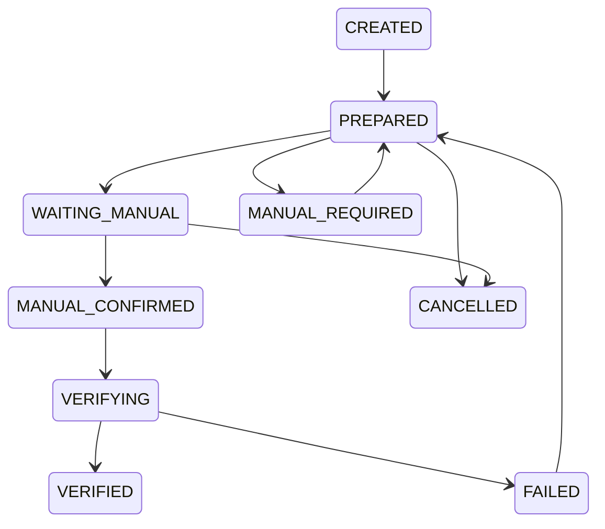

# Submission Hardening

Version: Sprint 12

Status: Implemented

## Cross Platform Contract

Reddit and X use the same Reply Execution Contract:

- `platform`
- `post_url`
- `external_post_id`
- `reply_task_id`
- `execution_task_id`
- `submission_task_id`
- `browser_session_id`
- `browser_tab_id`
- `status`
- `error_code`
- `error_message`
- `screenshots`
- `metadata`

The contract is produced by `SubmissionRuntime.contract()`.

## State Machine

Only Submission Runtime should change submission status.

## Manual Confirm

Reddit and X share the same manual confirm flow:

1. Execution fills the reply.
2. Submission enters `WAITING_MANUAL`.
3. Operator submits manually on the platform.
4. Operator confirms in ATOS.
5. `SubmissionRuntime.record_manual_result()` records the result.

Updated entities:

- `reply_tasks`
- `execution_tasks`
- `submission_tasks`
- `scheduler_tasks`
- `audit_logs`

## Verification Levels

- `NONE`
- `MANUAL_CONFIRMED`
- `DOM_VERIFIED`
- `URL_VERIFIED`
- `EXTERNAL_ID_VERIFIED`
- `FULL_VERIFIED`

Reddit and X currently support at least `MANUAL_CONFIRMED` in mock/test mode.

If result URL or external reply ID cannot be captured, `verification_status` is set to `MANUAL_CONFIRMED_UNVERIFIED`.

## Failure Classification

Unified failure classes:

- `LOGIN_REQUIRED`
- `REPLY_BOX_NOT_FOUND`
- `EDITOR_NOT_READY`
- `RATE_LIMITED`
- `PAGE_LOAD_FAILED`
- `BROWSER_DISCONNECTED`
- `WORKER_OFFLINE`
- `CONTENT_REJECTED`
- `SUBMISSION_FAILED`
- `VERIFICATION_FAILED`
- `MANUAL_REQUIRED`
- `UNKNOWN_ERROR`

Platform-specific errors are mapped into these classes.

## Retry Policy

Defaults:

- `max_reply_retry = 1`
- `max_submission_retry = 1`

Blocked from auto retry:

- `LOGIN_REQUIRED`
- `RATE_LIMITED`
- `CONTENT_REJECTED`
- `MANUAL_REQUIRED`

Recoverable:

- `BROWSER_DISCONNECTED`
- `WORKER_OFFLINE`

## Screenshot Standard

Standard steps:

- `before_open`
- `after_open`
- `before_reply_box`
- `after_reply_box`
- `before_fill`
- `after_fill`
- `waiting_manual`
- `manual_confirmed`
- `failure`

Screenshot paths are exposed in the submission contract.

## HTML Snapshot Standard

HTML snapshots are required for:

- `REPLY_BOX_NOT_FOUND`
- `EDITOR_NOT_READY`
- `PAGE_LOAD_FAILED`
- `SUBMISSION_FAILED`
- `VERIFICATION_FAILED`

## Reddit Hardening

Reddit adapter now supports multi-version selector fallback for:

- reply box
- submit button scaffold

It also supports test mode scenarios for automated validation.

## X Hardening

X adapter supports:

- URL normalization
- multi-version selector fallback
- reply dialog detection
- rich text editor fill
- login and rate-limit detection
- test mode scenarios

## API

- `GET /submission-tasks`
- `GET /submission-tasks/{id}`
- `POST /submission-tasks/{id}/confirm`
- `POST /submission-tasks/{id}/mark-failed`
- `POST /submission-tasks/{id}/retry`
- `POST /submission-tasks/{id}/cancel`
- `GET /submission-stats`
- `GET /submission-failures`
