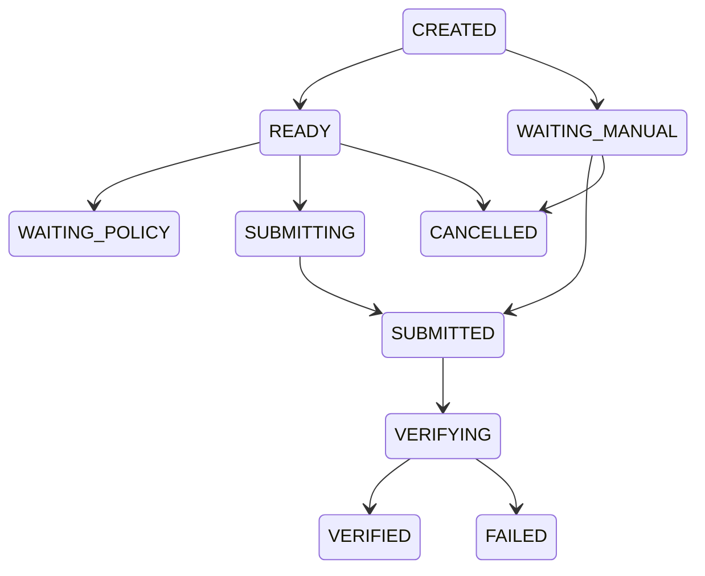

# ATOS Submission Runtime

Version: Sprint 10

Status: Implemented Scaffold

## Purpose

Submission Runtime is the layer after reply filling.

It is responsible for:

- submission policy evaluation
- manual confirmation recording
- guarded auto-assisted submission structure
- success verification
- result capture
- failure capture
- audit and timeline logs

Execution fills content. Submission Runtime records or performs submission according to policy.

## Default Policy

Default mode is `SEMI_AUTO`.

In `SEMI_AUTO`:

1. Execution fills the reply box.
2. Task enters `WAITING_MANUAL`.
3. Operator submits manually on the platform page.
4. Operator clicks manual confirm in ATOS.
5. Submission Runtime records and verifies the result.

`AUTO_ASSISTED` and `FULL_AUTO` are configuration-only by default. They do not run unless explicitly enabled in System Settings.

## Execution Modes

- `SEMI_AUTO`
- `AUTO_ASSISTED`
- `FULL_AUTO`

## Status Lifecycle

## Tables

### submission_tasks

Stores one submission attempt or manual result record.

Important fields:

- `reply_task_id`
- `execution_task_id`
- `platform`
- `account_id`
- `worker_id`
- `browser_session_id`
- `browser_tab_id`
- `execution_mode`
- `status`
- `submitted_at`
- `verified_at`
- `result_url`
- `result_external_id`
- `failure_reason`
- `manual_confirmed`

### submission_logs

Stores the timeline.

Important fields:

- `submission_task_id`
- `step`
- `level`
- `message`
- `metadata_json`
- `screenshot_path`
- `html_snapshot_path`

## Platform Adapter Contract

Platform adapters expose:

- `detect_submit_button()`
- `submit_reply()`
- `verify_reply_success()`
- `get_submitted_reply_url()`
- `get_submitted_reply_id()`

Unsupported platforms return `NOT_IMPLEMENTED`.

## Reddit Adapter

The Reddit adapter implements submission methods, but automatic submission is still policy-gated.

Before any submit attempt it checks:

- login required
- rate limit
- comments disabled
- submit button availability

Blocked cases return `BLOCKED_OR_MANUAL_REQUIRED`.

## API

- `GET /submission/dashboard`
- `GET /submission/tasks`
- `GET /submission/tasks/{id}`
- `POST /submission/tasks/{id}/submit`
- `POST /submission/tasks/{id}/record-manual-result`
- `POST /submission/tasks/{id}/cancel`
- `GET /submission/tasks/{id}/logs`
- `GET /submission/logs`
- `POST /submission/reply-tasks/{reply_task_id}/prepare-submission`

## Settings

Endpoint:

- `GET /settings/submission`
- `PUT /settings/submission`

Fields:

- `default_execution_mode`
- `auto_assisted_enabled`
- `full_auto_enabled`
- `max_retry`
- `verify_timeout_seconds`
- `capture_screenshot_enabled`
- `capture_html_enabled`

## Safety Rules

- Default is always `SEMI_AUTO`.
- A submit action is not success by itself.
- Verification is required.
- Login required and rate limited failures are not auto retried.
- Submission Runtime closes only the current tab after manual confirmation.
- Browser sessions remain running.
