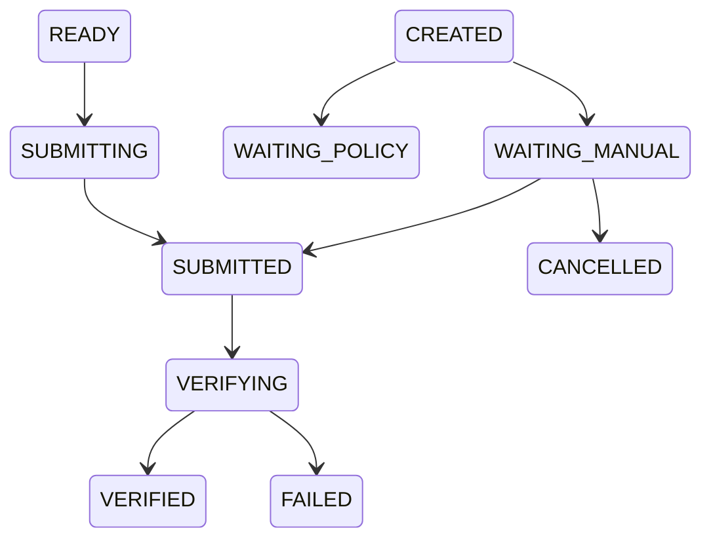

# Sprint-10 Submission Runtime

## Sprint Goal

Build Submission Runtime as the dedicated layer after reply filling.

The completed flow is:

Post Pool -> AI Runtime -> Reply Review -> Scheduler Runtime -> Execution Runtime -> Browser Runtime -> Platform Adapter -> Fill Reply -> WAITING_MANUAL -> Human Confirm -> Submission Runtime -> Verified Result

Default mode remains `SEMI_AUTO`.

## Completed

- Added `submission_tasks`.
- Added `submission_logs`.
- Added `SubmissionRuntime`.
- Added `ExecutionPolicyEngine`.
- Added Submission settings.
- Added Platform Adapter submission methods.
- Added Reddit submission adapter methods.
- Added X submission scaffold.
- Integrated ReplyPipeline manual confirmation with Submission Runtime.
- Added Submission API.
- Added Submission page.
- Added Dashboard Submission widget data.
- Added Seed submission tasks and logs.
- Added `docs/SUBMISSION_RUNTIME.md`.

## Policy

`AUTO_ASSISTED` and `FULL_AUTO` are present as configuration structure only.

They are disabled by default.

`SEMI_AUTO` requires the operator to submit manually on the platform and then confirm in ATOS.

## State Machine

## API Tested

- `GET /submission/dashboard`
- `GET /submission/tasks`
- `GET /submission/logs`
- `GET /settings/submission`
- `PUT /settings/submission`

## Mock Mode

Mock mode supports:

- manual result recording
- verification
- result URL
- external comment ID
- timeline logs
- dashboard counts

No TGE or Playwright is required for the demo flow.

## Known Issues

- Real platform verification still needs selector refinement.
- AUTO_ASSISTED path remains policy-gated and disabled.
- Full replay screenshot generation depends on prior Execution artifacts.
- Real Reddit submit should only be enabled after operator-level acceptance tests.

## Acceptance

Passed for the intended Sprint scope:

- Submission Runtime exists as an independent layer.
- Manual confirmation writes Submission task and logs.
- Default configuration remains human-in-the-loop.
- Dashboard and Submission page expose runtime state.

## Next Sprint

Recommended next step:

- Harden real platform verification selectors.
- Improve Submission detail replay preview.
- Add per-platform submission policy overrides.
