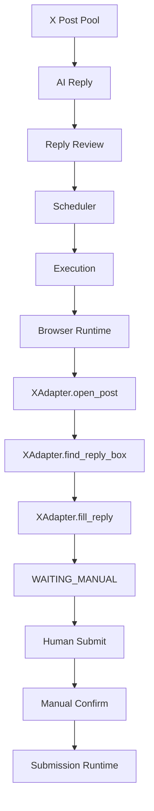

# Sprint-11 X Adapter v1

## Sprint Goal

Connect X to the standard ATOS semi-auto reply flow.

Default execution mode remains `SEMI_AUTO`.

No automatic submit is enabled.

## Completed Issues

- Implemented XAdapter v1.
- Added X URL normalization.
- Added X open post flow.
- Added X reply box detection.
- Added X rich text fill support.
- Added X login, rate limit, and error detection.
- Added X capture state scaffold.
- Declared X capabilities in Platform Runtime.
- Added X selector seed records.
- Added X seed posts, replies, reply tasks, execution tasks, and submission tasks.
- Added X execution timeline events.
- Added X manual confirmation integration through existing Submission Runtime.
- Added X adapter tests.
- Added X platform documentation.
- Updated operator manual.

## X Adapter Status

Implemented:

- `open_post()`
- `find_reply_box()`
- `fill_reply()`
- `detect_login_required()`
- `detect_rate_limit()`
- `detect_error_state()`
- `capture_state()`

Submission:

- `submit_reply()` returns manual-required / scaffold responses.
- `verify_reply_success()` supports mock verification and manual confirm compatibility.

## Supported Flow

## Known Issues

- Real X selectors need live account validation.
- X auto submit is intentionally not implemented.
- Screenshot files are represented through replay paths unless a real browser run captures them.
- X rate-limit and login text may vary by locale.

## Acceptance

Accepted for Sprint 11 scope:

1. X posts can exist in Post Pool with canonical X URLs.
2. X reply tasks reuse existing task tables.
3. X can reach `WAITING_MANUAL` in mock/test mode.
4. Manual confirmation records through Submission Runtime.
5. Reddit tests still pass.
6. `AUTO_ASSISTED` / `FULL_AUTO` remain disabled by default.

## Next Sprint Recommendation

- Validate X selectors against a real logged-in TGE profile.
- Add selector version test snapshots.
- Improve X replay screenshot preview.
- Add per-platform manual checklist in Execution UI.
