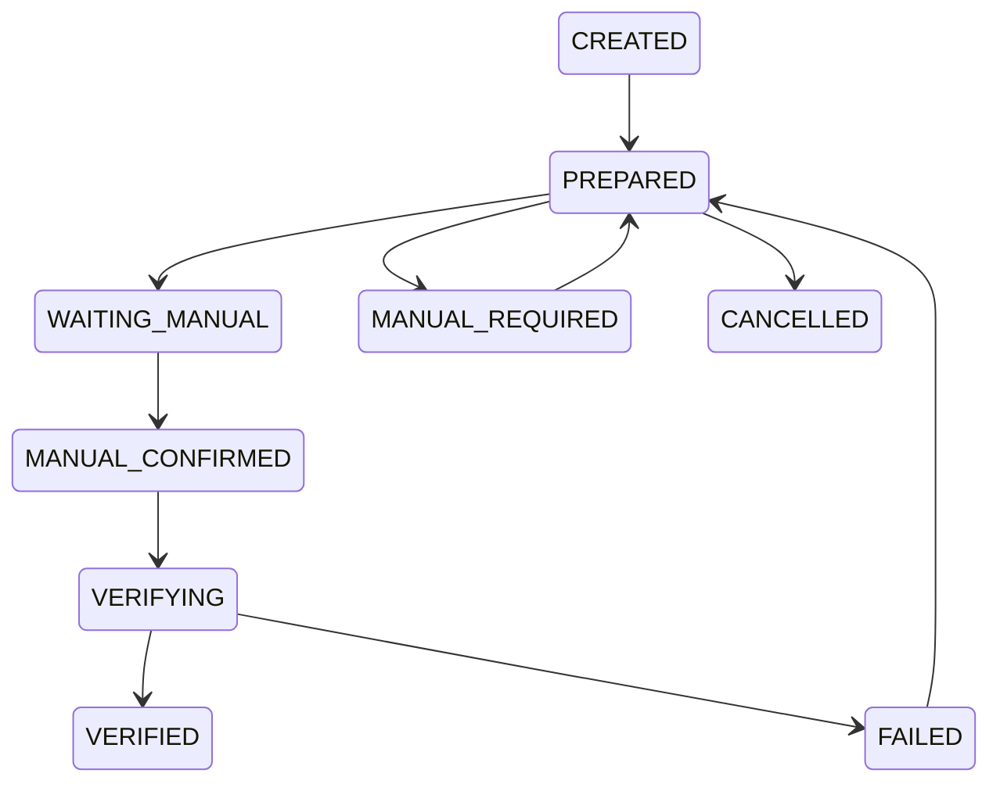

# Sprint-12 Cross-Platform Submission Hardening

## Sprint Goal

Harden Reddit and X semi-auto reply execution and submission recording.

Default execution mode remains `SEMI_AUTO`.

`AUTO_ASSISTED` and `FULL_AUTO` remain disabled by default.

## Completed Issues

- Added unified Reply Execution Contract.
- Unified manual confirm through Submission Runtime.
- Added result recording fields.
- Added verification levels.
- Centralized submission state transitions.
- Added unified failure classification.
- Added Failure Recovery Service.
- Added Retry Guard.
- Standardized screenshot paths.
- Standardized HTML snapshot paths.
- Added execution timeline events.
- Hardened audit events for result recording, retry, and failures.
- Added Mark Failed flow.
- Added Retry flow.
- Hardened Reddit selector fallback.
- Hardened X selector fallback and test mode.
- Added cross-platform dashboard metrics.
- Added submission statistics.
- Added hardening settings.
- Added Sprint 12 API aliases.

## Reddit Status

Reddit supports:

- open post
- reply box detection
- reply fill
- waiting manual
- manual confirm
- failure classification
- selector fallback
- test mode

## X Status

X supports:

- canonical URL normalization
- open post
- reply dialog detection
- rich text editor fill
- waiting manual
- manual confirm
- failure classification
- selector fallback
- test mode

## Submission State Machine

## Known Issues

- Real screenshot files depend on real Browser Runtime capture.
- Real DOM verification still requires live Reddit and X selector validation.
- Manual confirm can be verified in mock mode; production should gradually upgrade to DOM and external ID verification.

## Next Sprint Recommendation

- Validate Reddit and X selectors in a real TGE profile.
- Add replay preview UI for standardized screenshot steps.
- Add per-platform recovery policy overrides.
- Add operator assignment and permission checks for manual confirm.
